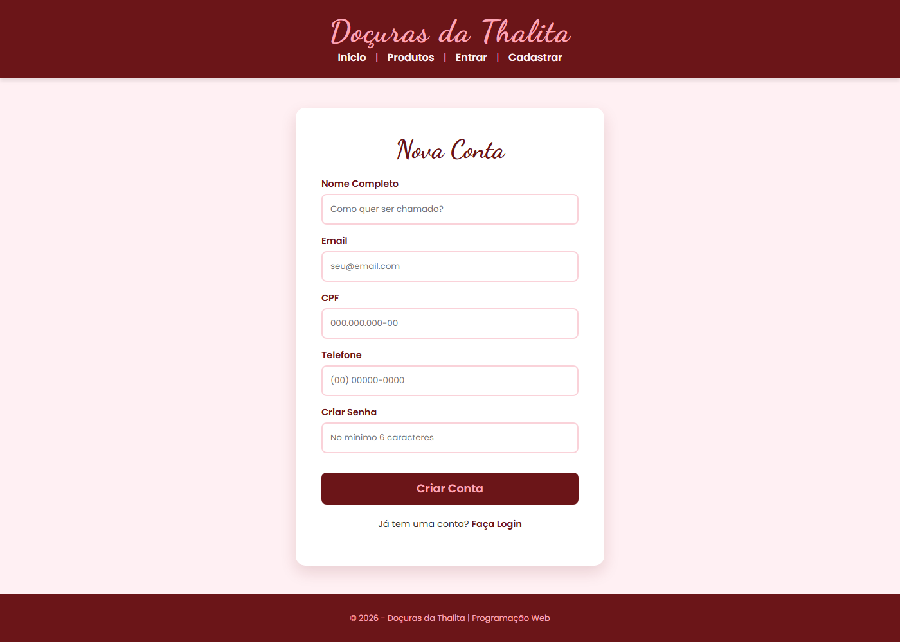
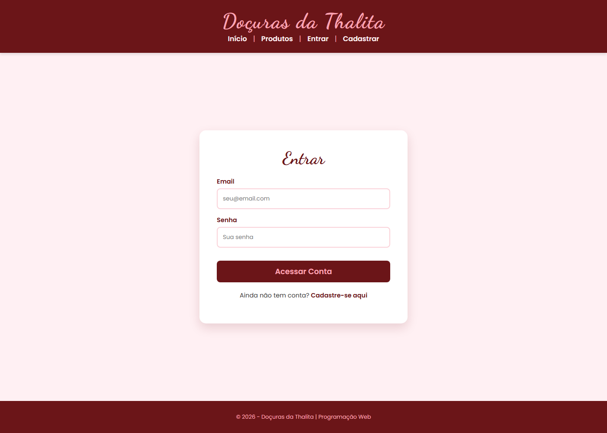
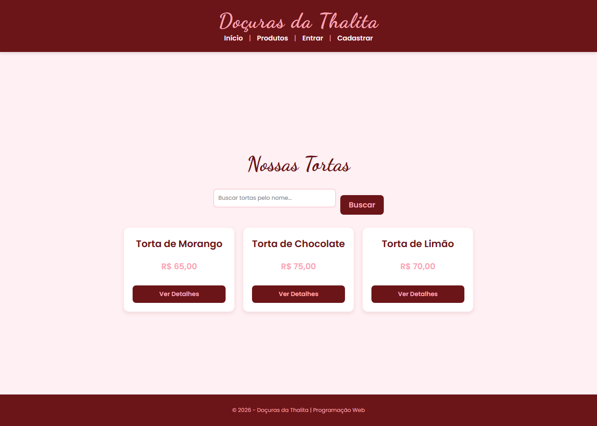
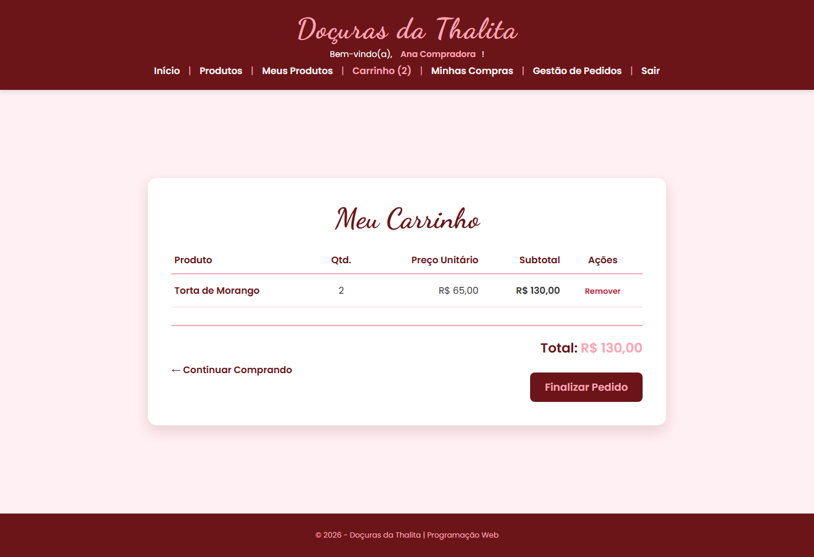
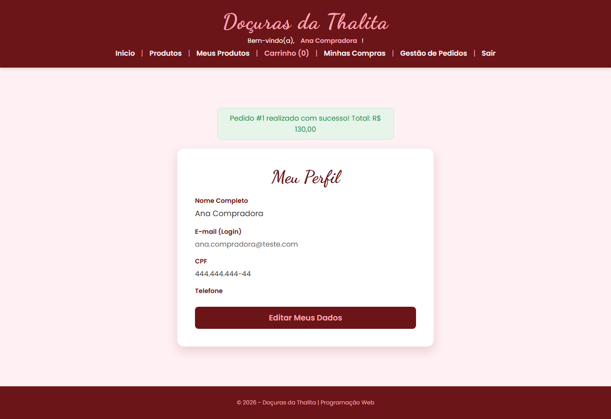
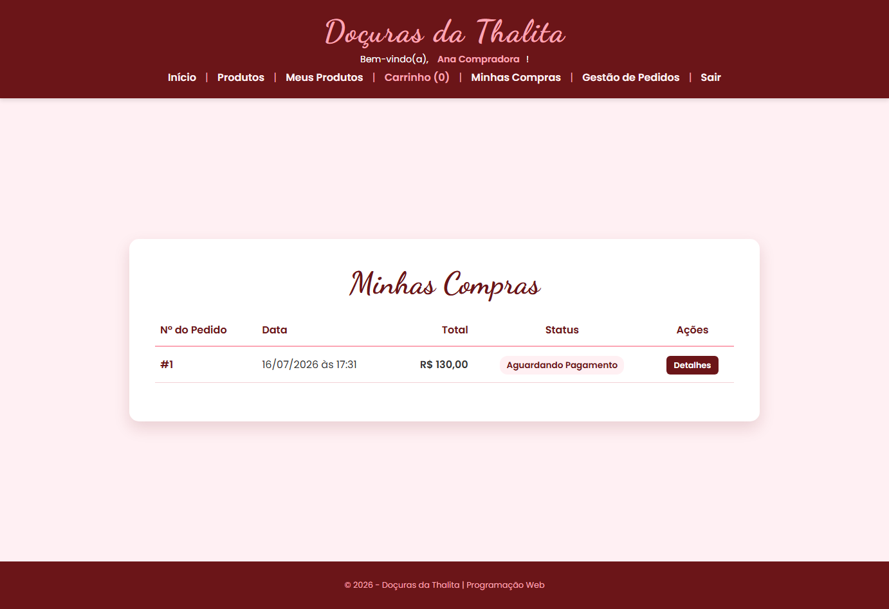
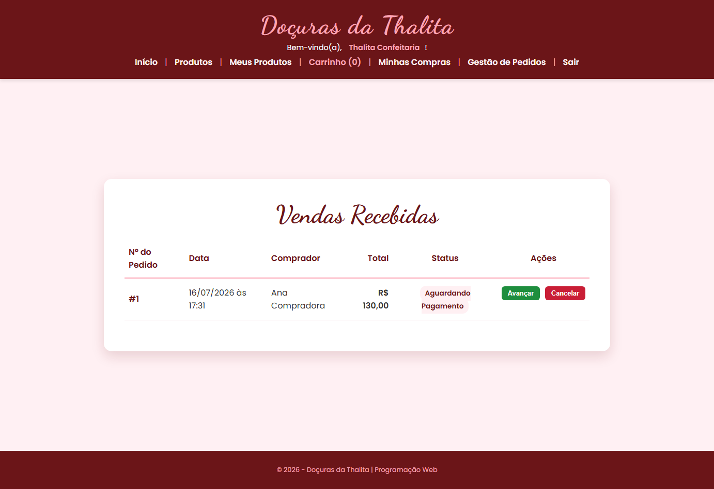

# Doçuras da Thalita 🍰

Sistema de **e-commerce e gestão** para uma confeitaria artesanal, desenvolvido em **Sinatra (Ruby)** com **ActiveRecord**. A aplicação permite que clientes naveguem pelo catálogo de tortas, montem um carrinho e finalizem pedidos, enquanto vendedores cadastram produtos e acompanham o ciclo de vida das vendas recebidas, do pagamento até a entrega.

## Tecnologias utilizadas

- **[Ruby](https://www.ruby-lang.org/)** — linguagem da aplicação
- **[Sinatra](https://sinatrarb.com/)** — micro-framework web
- **[ActiveRecord](https://guides.rubyonrails.org/active_record_basics.html)** (via `sinatra-activerecord`) — ORM e migrations
- **[SQLite3](https://www.sqlite.org/)** — banco de dados
- **ERB** — templates de view
- **[Puma](https://puma.io/)** — servidor de aplicação
- **[RSpec](https://rspec.info/)** + **[Capybara](https://github.com/teamcapybara/capybara)** + **Rack::Test** — testes automatizados (models, controllers e features)

## Funcionalidades principais

- Cadastro e autenticação de usuários — qualquer usuário pode publicar produtos e também comprar; o papel de "vendedor" ou "comprador" é apenas inferido pelas associações (produtos cadastrados / compras realizadas), não um campo fixo de conta
- Catálogo de produtos (tortas) com busca por nome, detalhes, preço e estoque
- Carrinho de compras e finalização de pedidos
- Gestão de vendas recebidas, com avanço e cancelamento de status até a entrega
- Histórico de compras do usuário

---

## Pré-requisitos

Para rodar o projeto localmente você precisa ter instalado:

| Ferramenta | Versão utilizada no desenvolvimento |
|---|---|
| [Ruby](https://www.ruby-lang.org/) | 4.0.5 (recomendado: 3.2 ou superior) |
| [Bundler](https://bundler.io/) | 4.0.10 |
| [Git](https://git-scm.com/) | 2.54 |

O **SQLite3** não precisa ser instalado separadamente no sistema: a gem `sqlite3` já traz o motor do banco embutido e é instalada automaticamente pelo `bundle install`.

### Como verificar se já estão instalados

```bash
ruby -v        # deve exibir a versão do Ruby
bundle -v      # deve exibir a versão do Bundler
git --version  # deve exibir a versão do Git
```

Se o Bundler não estiver instalado, instale com:

```bash
gem install bundler
```

---

## Instalação

```bash
# 1. Clonar o repositório
git clone <URL-do-repositório>

# 2. Acessar a pasta do projeto
cd ecommerce-sinatra

# 3. Instalar as dependências
bundle install
```

Se o `bundle install` terminar exibindo `Bundle complete!` junto com a contagem de gems instaladas, todas as dependências foram instaladas corretamente.

---

## Configuração de variáveis de ambiente

A aplicação usa a variável `SESSION_SECRET` para assinar o cookie de sessão. Ela **não fica no código-fonte** — precisa ser definida em um arquivo `.env` local (que não é versionado no Git).

```bash
# Copie o arquivo de exemplo
cp .env.example .env        # Linux/Mac/WSL
copy .env.example .env      # Windows (PowerShell/cmd)
```

Por padrão o `.env.example` já vem com um valor de exemplo funcional para uso local/acadêmico. Se quiser gerar um valor próprio (recomendado fora do contexto da disciplina), use:

```bash
ruby -rsecurerandom -e "puts SecureRandom.hex(64)"
```

e cole o resultado como valor de `SESSION_SECRET` no `.env`.

> Sem o arquivo `.env`, a aplicação (e os testes) não iniciam — em vez de usar um segredo padrão inseguro, ela mostra um erro claro pedindo para criar o `.env`.

---

## Configuração do banco de dados

O projeto usa **SQLite** com um arquivo de banco por ambiente (`development`, `test` e `production`), definidos em `config/database.rb`. Não é necessário criar o banco manualmente: basta rodar as migrations.

```bash
# Executa todas as migrations pendentes (cria db/development.sqlite3)
bundle exec rake db:migrate

# (Opcional) Popula o banco com dados de exemplo (vendedor, produtos e uma venda)
bundle exec rake db:seed
```

Para conferir se o banco foi criado e as migrations foram aplicadas corretamente:

```bash
bundle exec rake db:migrate:status
```

O comando deve listar todas as migrations com status `up`:

```
database: db/development.sqlite3

 Status   Migration ID    Migration Name
--------------------------------------------------
   up     20260714192543  Create initial setup
   up     20260714194342  Create usuarios
   up     20260714194912  Create produtos
   up     20260714195306  Create vendas
   up     20260714195632  Create itens venda
   up     20260715001747  Add tipo to usuarios
   up     20260716120000  Remove tipo from usuarios
```

> O ambiente de **teste** usa um banco separado (`db/test.sqlite3`), que **também precisa ser migrado manualmente** (ele não é versionado no Git e não é criado sozinho):
>
> ```bash
> RACK_ENV=test bundle exec rake db:migrate
> ```
>
> Depois de migrado, a suíte do RSpec cuida de limpar os dados entre os testes automaticamente (cada teste roda dentro de uma transação que é revertida no final).

---

## Executando a aplicação

Com as dependências instaladas e o banco configurado, inicie o servidor com:

```bash
bundle exec rackup config.ru
```

Por padrão o servidor (Puma) sobe em modo `development` e fica disponível em:

```
http://127.0.0.1:9292
```

Para encerrar, use `Ctrl+C` no terminal.

---

## Executando os testes

A suíte de testes usa **RSpec**, com **Rack::Test** para testes de model/controller e **Capybara** para testes de feature (fluxo completo simulado em um navegador virtual).

```bash
# Roda toda a suíte de testes
bundle exec rspec
```

### Organização dos testes

```
spec/
├── models/          # Regras de negócio e validações (User, Product, Sale)
├── controllers/      # Rotas HTTP (GET/POST) via Rack::Test
├── features/          # Fluxo completo ponta a ponta via Capybara
│                       #   (cadastro → login → publicar produto → comprar → status)
└── spec_helper.rb    # Configuração do ambiente de teste (RACK_ENV=test)
```

### Resultado esperado

Quando todos os testes passam, a saída final do RSpec é semelhante a:

```
75 examples, 0 failures
```

---

## Estrutura do projeto

```
ecommerce-sinatra/
├── app/
│   ├── controllers/   # Rotas Sinatra, uma classe por área (auth, products, cart, sales, purchases, profile)
│   ├── models/        # Classes ActiveRecord (User, Product, Sale, SaleItem)
│   ├── views/          # Templates ERB, organizados por controller
│   ├── helpers/        # Módulos auxiliares (autenticação, carrinho, flash messages, formatação)
│   └── services/        # Regras de negócio mais complexas (checkout e transição de status da venda)
├── config/
│   ├── database.rb     # Configuração de conexão com o SQLite por ambiente
│   ├── environment.rb  # Carregamento da aplicação (gems, models, controllers, rotas)
│   └── routes.rb        # Registro automático dos controllers
├── db/
│   ├── migrate/          # Migrations do banco de dados
│   ├── schema.rb          # Schema atual do banco
│   └── seeds.rb            # Dados de exemplo para popular o banco
├── public/
│   └── css/               # Estilos da aplicação
├── spec/                    # Testes automatizados (models, controllers, features)
├── docs/screenshots/         # Capturas de tela usadas neste README
├── app.rb                     # Ponto de entrada da aplicação (classe Sinatra)
├── config.ru                   # Arquivo Rack usado pelo `rackup` para subir o servidor
└── Rakefile                     # Tarefas de banco de dados (migrations, seed)
```

---

## Capturas de tela

### Tela de cadastro
Formulário público para criação de conta. Qualquer conta criada aqui já pode publicar produtos e/ou comprar — não há um formulário separado para "conta de vendedor".



### Tela de login
Autenticação por e-mail e senha.



### Listagem de produtos
Catálogo de tortas disponível para qualquer visitante, com preço e acesso aos detalhes de cada produto.



### Carrinho de compras
Itens adicionados pelo cliente, com quantidade, subtotal e total do pedido antes da finalização.



### Finalizar compra
Confirmação exibida ao cliente após o checkout, com o número e o valor total do pedido gerado.



### Minhas compras
Histórico de pedidos do cliente, com o status atual de cada um.



### Vendas recebidas
Painel do vendedor para acompanhar os pedidos recebidos e avançar ou cancelar o status de cada venda.



---

## Funcionalidades implementadas

- [x] Cadastro de usuários
- [x] Autenticação por sessão (login/logout)
- [x] Papel de vendedor/comprador inferido pelas associações — o mesmo usuário pode publicar produtos e também comprar, sem um campo fixo de "tipo de conta"
- [x] Edição de perfil (dados pessoais e senha)
- [x] CRUD de produtos (cadastrar, editar, excluir) pelo próprio vendedor
- [x] Listagem geral de produtos, com busca por nome
- [x] Listagem dos produtos do próprio usuário ("Meus Produtos")
- [x] Carrinho de compras (adicionar e remover itens)
- [x] Finalização de compra (checkout) com criação da venda
- [x] Controle de estoque (débito na compra, restauração no cancelamento)
- [x] Atualização do status da venda (pendente → paga → enviada → entregue, ou cancelada)
- [x] Cancelamento de compra pelo cliente, somente enquanto o pedido está pendente
- [x] Histórico de compras do cliente
- [x] Painel de vendas recebidas do vendedor
- [x] Validações de dados (e-mail único, campos obrigatórios, senha, estoque disponível)
- [x] Mensagens de feedback (flash messages) de sucesso e erro

---

## Integrantes

| Integrante |
|---|
| Julia Pinheiro Santos |
| Giovanna Gonçalves Patrício Costa dos Santos |

- **Disciplina:** Programação Web
- **Professor:** Luiz Fernando Batista Loja
- **Instituição:** Instituto Federal de Goiás (IFG)
- **Curso:** Ciência da Computação
- **Período:** 3º Período
